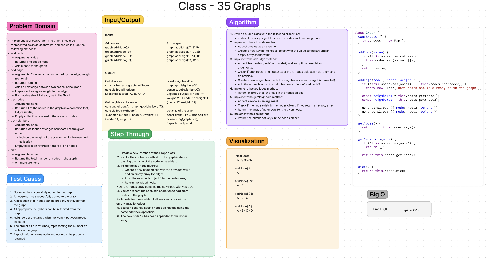

# [Code Challenge - 35](https://codefellows.github.io/common_curriculum/data_structures_and_algorithms/Code_401/class-35/)

## Implement your own Graph.

The graph should be represented as an adjacency list, and should include the following methods:

### add node

* Arguments: value
* Returns: The added node
* Add a node to the graph

### add edge

* Arguments: 2 nodes to be connected by the edge, weight (optional)
* Returns: nothing
* Adds a new edge between two nodes in the graph
* If specified, assign a weight to the edge
* Both nodes should already be in the Graph

### get nodes

* Arguments: none
* Returns all of the nodes in the graph as a collection (set, list, or similar)
* Empty collection returned if there are no nodes

### get neighbors

* Arguments: node
* Returns a collection of edges connected to the given node
* Include the weight of the connection in the returned collection
* Empty collection returned if there are no nodes

### size

* Arguments: none
* Returns the total number of nodes in the graph
* 0 if there are none

## Whiteboard Process

## Collaboration

## Approach & Efficiency
<!-- What approach did you take? Why? What is the Big O space/time for this approach? -->

 - [x] Top-level README “Table of Contents” is updated
 - [x] README for this challenge is complete
       - [x] Summary, Description, Approach & Efficiency, Solution
       - [x] Picture of whiteboard
       - [x] [Link to code](https://github.com/EvaGraceSmith/data-structures-and-algorithms/blob/main/javascript/linked-list/index.js) -
 - [x] Feature tasks for this challenge are completed
 - [x] Unit tests written and passing
       - [x] “Happy Path” - Expected outcome
       - [x] Expected failure
       - [x] Edge Case (if applicable/obvious)
