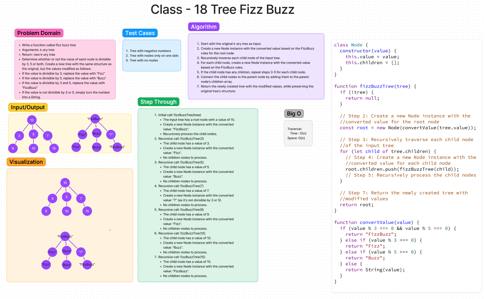

# Code Challenge - 18 [Tree Fizz Buzz](https://codefellows.github.io/common_curriculum/data_structures_and_algorithms/Code_401/class-18/)

* Write a function called fizz buzz tree
* Arguments: k-ary tree
* Return: new k-ary tree
* Determine whether or not the value of each node is divisible by 3, 5 or both. Create a new tree with the same structure as the original, but the values modified as follows:
* If the value is divisible by 3, replace the value with “Fizz”
* If the value is divisible by 5, replace the value with “Buzz”
* If the value is divisible by 3 and 5, replace the value with “FizzBuzz”
* If the value is not divisible by 3 or 5, simply turn the number into a String.

## Whiteboard Process

## Collaboration

## Approach & Efficiency
<!-- What approach did you take? Why? What is the Big O space/time for this approach? -->

 - [x] Top-level README “Table of Contents” is updated
 - [x] README for this challenge is complete
       - [x] Summary, Description, Approach & Efficiency, Solution
       - [x] Picture of whiteboard
       - [x] [Link to code](https://github.com/EvaGraceSmith/data-structures-and-algorithms/blob/main/javascript/) -
 - [x] Feature tasks for this challenge are completed
 - [x] Unit tests written and passing
       - [x] “Happy Path” - Expected outcome
       - [ ] Expected failure
       - [x] Edge Case (if applicable/obvious)
