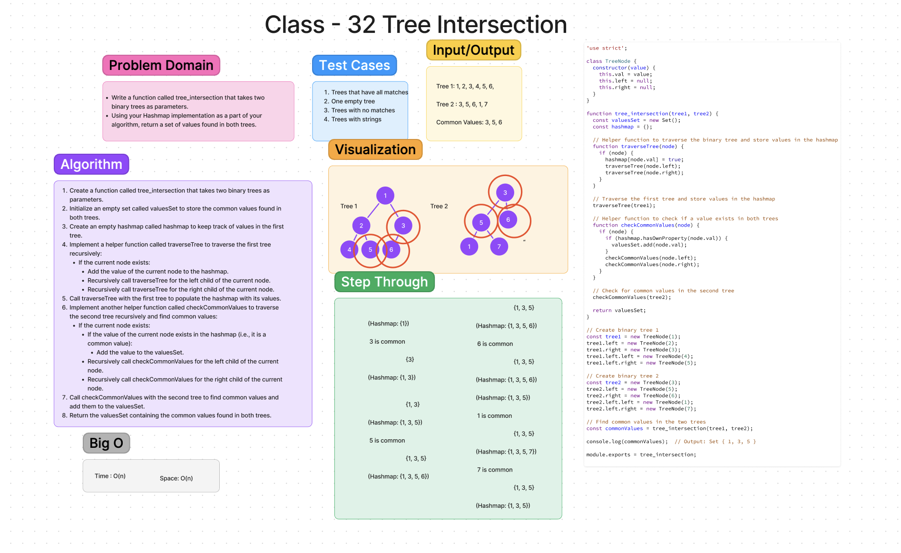

# [Code Challenge - 32](https://codefellows.github.io/common_curriculum/data_structures_and_algorithms/Code_401/class-32/)

Write a function called tree_intersection that takes two binary trees as parameters.
Using your Hashmap implementation as a part of your algorithm, return a set of values found in both trees.

## Whiteboard Process

## Collaboration

## Approach & Efficiency
<!-- What approach did you take? Why? What is the Big O space/time for this approach? -->

 - [x] Top-level README “Table of Contents” is updated
 - [x] README for this challenge is complete
       - [x] Summary, Description, Approach & Efficiency, Solution
       - [x] Picture of whiteboard
       - [x] [Link to code](https://github.com/EvaGraceSmith/data-structures-and-algorithms/blob/main/javascript/linked-list/index.js) -
 - [x] Feature tasks for this challenge are completed
 - [x] Unit tests written and passing
       - [x] “Happy Path” - Expected outcome
       - [x] Expected failure
       - [x] Edge Case (if applicable/obvious)
