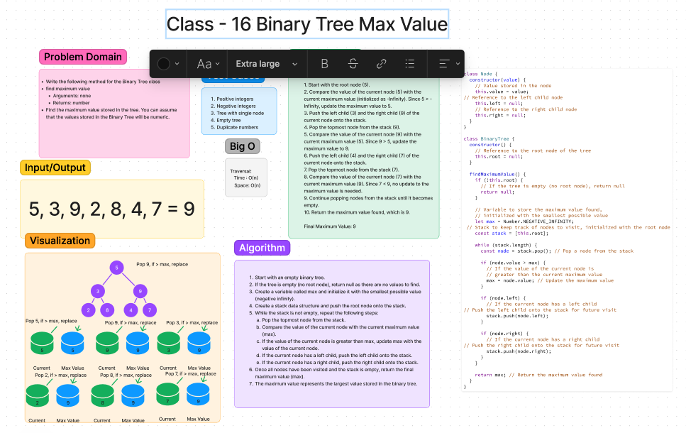

# Code Challenge - 16
<!-- Description of the challenge -->

## Whiteboard Process

## Collaboration

## Approach & Efficiency
<!-- What approach did you take? Why? What is the Big O space/time for this approach? -->

 - [x] Top-level README “Table of Contents” is updated
 - [x] README for this challenge is complete
       - [x] Summary, Description, Approach & Efficiency, Solution
       - [x] Picture of whiteboard
       - [x] [Link to code](https://github.com/EvaGraceSmith/data-structures-and-algorithms/blob/main/javascript/) -
 - [ ] Feature tasks for this challenge are completed
 - [x] Unit tests written and passing
       - [x] “Happy Path” - Expected outcome
       - [ ] Expected failure
       - [x] Edge Case (if applicable/obvious)
