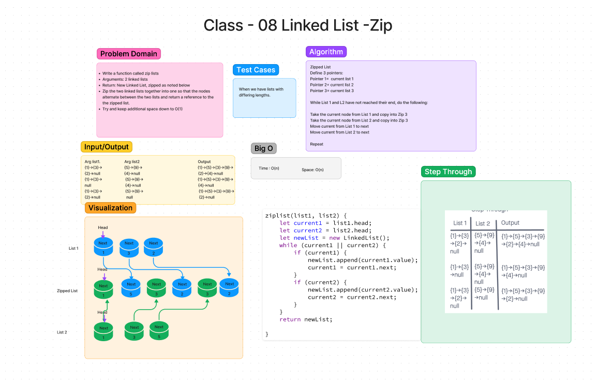

# Code Challenge - 06
<!-- Description of the challenge -->

## Whiteboard Process

## Approach & Efficiency
<!-- What approach did you take? Why? What is the Big O space/time for this approach? -->

 - [x] Top-level README “Table of Contents” is updated
 - [x] README for this challenge is complete
       - [x] Summary, Description, Approach & Efficiency, Solution
       - [x] Picture of whiteboard
       - [x] [Link to code](https://github.com/EvaGraceSmith/data-structures-and-algorithms/blob/main/javascript/linked-list/index.js) -
 - [ ] Feature tasks for this challenge are completed
 - [x] Unit tests written and passing
       - [x] “Happy Path” - Expected outcome
       - [ ] Expected failure
       - [x] Edge Case (if applicable/obvious)

### This code was done in collaboration with:

  [Kaeden O’Meara](https://github.com/KaedenOC)

## Solution
<!-- Show how to run your code, and examples of it in action -->

# Code Challenge - 07

## Whiteboard Process

## Approach & Efficiency
<!-- What approach did you take? Why? What is the Big O space/time for this approach? -->

 - [x] Top-level README “Table of Contents” is updated
 - [x] README for this challenge is complete
       - [x] Summary, Description, Approach & Efficiency, Solution
       - [x] Picture of whiteboard
       - [x] [Link to code](https://github.com/EvaGraceSmith/data-structures-and-algorithms/blob/main/javascript/linked-list/index.js)
 - [x] Feature tasks for this challenge are completed
 - [x] Unit tests written and passing
       - [x] “Happy Path” - Expected outcome
       - [x] Expected failure
       - [x] Edge Case (if applicable/obvious)

### This code was done in collaboration with:

[Malik Sadiki-Torres](https://github.com/MalikTorres)

# Code Challenge - 07

## Whiteboard Process

## Approach & Efficiency
<!-- What approach did you take? Why? What is the Big O space/time for this approach? -->

 - [x] Top-level README “Table of Contents” is updated
 - [x] README for this challenge is complete
       - [x] Summary, Description, Approach & Efficiency, Solution
       - [x] Picture of whiteboard
       - [x] [Link to code](https://github.com/EvaGraceSmith/data-structures-and-algorithms/blob/main/javascript/linked-list/index.js)
 - [x] Feature tasks for this challenge are completed
 - [x] Unit tests written and passing
       - [x] “Happy Path” - Expected outcome
       - [x] Expected failure
       - [x] Edge Case (if applicable/obvious)

### This code was done in collaboration with:

[Hayden Cooper](https://github.com/Hcooper23)
